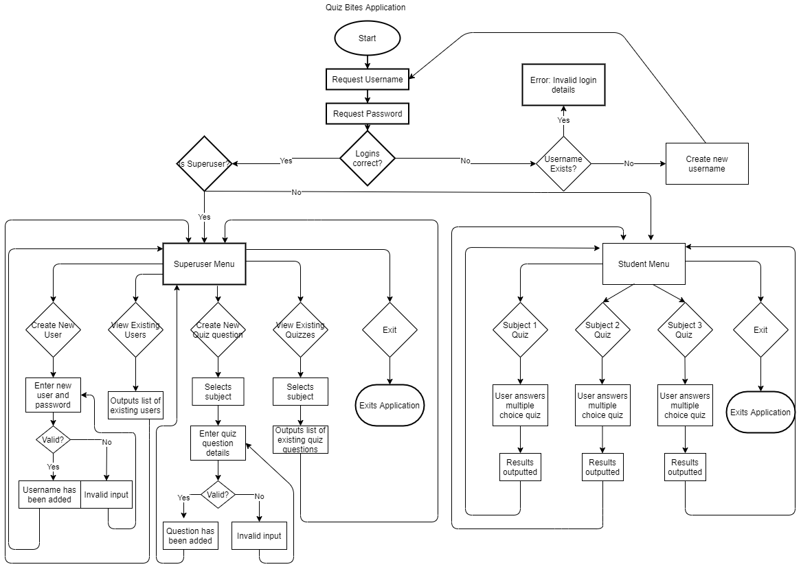

### Source Reference

### Link to Source Control Repository
https://github.com/Leanne2603/LeanneStranks_T1A3.git

### Scope and Statement of Purpose

The purpose of this application is to allow students to practice multiple choice quiz questions in relation to their subject of study. It allows the teacher to upload a series of questions to file and the students can log in and access these questions via a quiz which provides a random output.

It will allow assist students with practicing for tests and prepare them for when it comes to the graded exams. They will be able to access this quiz in their own time and assist them with retaining the information as they will be able to access the quiz as often as they wish. I am developing this application as I like the idea of being able to help people achieve their goals in education. Education is a very important and creating an application that can assist a student improve their knowledge would be rewarding to me.

The target audience for this application would be facilitators and students.

The facilitator will use the application to add multiple choice quiz questions to the list to expand the questions which are asked. They will have a Facilitator login which has permissions to do this. They will also have access to create a new user.

The student will log into the application and be presented with a menu of a list of subjects they can choose to be quizzed on. The student will not have access to modify the list of questions.

### Features

1. Password/Permissions - The facilitator will have access to create new users, edit user details. This will be classed as the "Superuser" login which will have full attribute access to read and write. If the user is logged in successfully, they will be presented with a menu relevant to their access level. If the login details are incorrect, they will receive a login error and will need to try logging in again.
2. Superuser Menu - This menu will be used by the facilitators which will include menu options such as "create new user", "edit/view existing user", "create new multiple choice quiz", "edit/view existing multiple choice quiz". The user will loop through this menu until they choose to exit. Each time a task is executed, it will take them back to the main menu. The input of the superuser will be written to the file.
3. Student Menu - The student menu have a selection of subjects which they can choose to be quizzed on and the option they choose will loop through 10 questions and provide the results at the end of the quiz advising if the answers were correct/incorrect. They will then have the option to either go back to the main menu or exit.

### Outline of User Interaction and Experience

- The user will be presented with a login request where they will need to enter their username and password - this will determine the menu presented to them based on their permissions. An incorrect login entered will loop the program back to request their login details again, otherwise, they can exit the program by typing exit. 
- The user will then be able to select the next step by selecting their choice from the given menu. For a facilitator, this would be to edit an existing quiz list or add a new quiz list and to set up a new user, for a student, they will be asked what subject they would like to be quizzed on. The quiz will then present them with 10 multiple choice questions to answer and they will be presented with which questions they got correct/incorrect at the end of the quiz
- Errors will be handled by indicating what has gone wrong with the program i.e. was it incorrect input such as username/password. There will also be a generic error which will occur if all other exceptions have been checked. This will say something like "An error has occurred, please try again!" and the app will loop back to the beginning of the menu which they are currently on. Errors will be displayed in a red colour using the Ruby gem colorize to distinguish it as an error.

## Control Flow Diagram

## Implementation Plan

(https://trello.com/b/4QOjEAmJ/quiz-bites-application)

*- outlines how each feature will be implemented and a checklist of tasks for each feature*
*- prioritise the implementation of different features, or checklist items within a feature*
*- provide a deadline, duration or other time indicator for each feature or checklist/checklist-item*

*Utilise a suitable project management platform to track this implementation plan*

*> Your checklists for each feature should have at least 5 items.*

## Design Help Documentation
System designed and tested on a Windows PC
*You must include:*
*- steps to install the application*
*- any dependencies required by the application to operate*
*- any system/hardware requirements*

