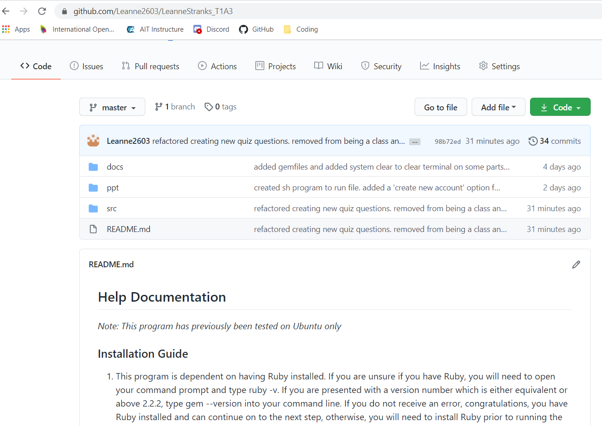
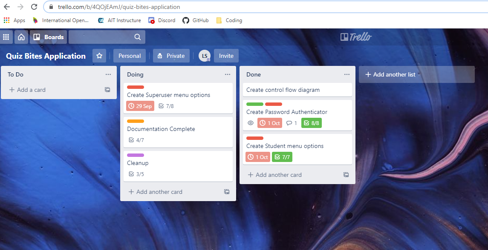

## Help Documentation

### Installation Guide
1. This program is dependent on having Ruby installed. If you are unsure if you have Ruby, you will need to open your command prompt and type ruby -v. If you are presented with a 
version number which is either equivalent or above 2.2.2, type gem --version into your command line. If you do not receive an error, congratulations, you have Ruby installed and can continue on to the next step, otherwise, you will need to install Ruby prior to running the program.
2. Once you have confirmed you have Ruby installed, enter the following command into your terminal (note: if you are using a Windows terminal - the below command will not work and you will not be able to execute the program):
```
sh -c "$(curl -fsSL https://raw.githubusercontent.com/Leanne2603/LeanneStranks_T1A3/master/src/run_program.sh)"
```

This should:
- Clone the file from Github
- Change into the directory required
- Install required gems
- Open the program

### Dependencies
If for any reason, the installation fails and does not work as expected - the below is what is required to run the program:
#### Github Repository
The Github repository can be cloned and accessed here: https://github.com/Leanne2603/LeanneStranks_T1A3
#### Ruby environment 2.7.0
Refer to step 1 of the installation guide.
#### Gem "rainbow", "~> 3.0"
No reported issues - You can install the gem by entering the following into your terminal: gem install rainbow
#### Gem "tty-prompt", "~> 0.22.0"
Whilst this gem is supported on: Linux, OS X, FreeBSD and Windows systems, you will experience a better result on a Unix-like platform. 
If using Windows - consider installing ConEmu, cmder or PowerCmd
To install the tty-prompt gem, enter the following into your terminal: gem install tty-prompt
#### Gem "tty-font", "~> 0.5.0"
No reported issues - To install, enter the following into your terminal: gem install tty-font
#### "picture_frame", "~> 0.0.4"
No reported issues. You can install the gem by entering the following into your terminal: gem install picture_frame
#### json
This should be pre-installed
#### csv
This should be pre-installed

## Link to Source Control Repository
https://github.com/Leanne2603/LeanneStranks_T1A3.git



## Scope and Statement of Purpose

The purpose of this application is to allow students to practice multiple choice quiz questions in relation to their subject of study. It allows the facilitator to upload a series of questions to file and the students can log in and access these questions via a quiz which provides a random output.

It will allow assist students with practicing for tests and prepare them for when it comes to the graded exams. The students will be able to access this quiz in their own time and assist them with retaining the information as they will be able to access the quiz as often as they wish. I am developing this application as I like the idea of being able to help people achieve their goals in education. Education is a very important and creating an application that can assist a student improve their knowledge would be rewarding to me.

The target audience for this application would be facilitators and students. The facilitator would manage their own class and have the capability of adding new facilitators if required. Students will also have the ability to sign up on their own accord. As this is an educational tool, the initial stages will be just to answer the quiz questions and see how well they are progressing, therefore; there is currently no issues of security issues as no information is stored. The login has been created to account for future any development which will include storing the student's quiz results/creating goals and a more personalised feel.

The facilitator will use the application to add multiple choice quiz questions to the list to expand the questions which are asked. They will have a Facilitator login which has permissions to do this. They will also have access to create a new user/view existing users.

The student will log into the application and be presented with a menu of a list of subjects they can choose to be quizzed on. The student will not have access to modify the list of questions and will be advised of their result at the end of the quiz. The quiz will ask 10 questions.

## Features

1. Password/Permissions - The facilitator will have access to create new users, edit user details. This will be classed as the "Superuser" login which will have full attribute access to read and write. If the user is logged in successfully, they will be presented with a menu relevant to their access level. If the login details are incorrect, they will receive a login error and will need to try logging in again.
2. Superuser Menu - This menu will be used by the facilitators which will include menu options such as "create new user", "edit/view existing user", "create new multiple choice quiz", "edit/view existing multiple choice quiz". The user will loop through this menu until they choose to exit. Each time a task is executed, it will take them back to the main menu. The input of the superuser will be written to the file.
3. Student Menu - The student menu have a selection of subjects which they can choose to be quizzed on and the option they choose will loop through 10 questions and provide the results at the end of the quiz advising if the answers were correct/incorrect. They will then have the option to either go back to the main menu or exit.

## Outline of User Interaction and Experience

- The user will be presented with a menu to either create a new account or login. The user will then be requested to enter their username and password - this will determine the menu presented to them based on their permissions assigned which is stored in a JSON file. An incorrect login entered will loop the program back to request their login details again, otherwise, they can exit the program by typing exit. 
- The user will then be able to select the next step by selecting their choice from the given menu. For a facilitator, this would be to edit an existing quiz list or add a new quiz list and to set up a new user, for a student, they will be asked what subject they would like to be quizzed on. The quiz will then present them with 10 multiple choice questions to answer and they will be presented with which questions they got correct/incorrect at the end of the quiz
- Errors will be handled by indicating what has gone wrong with the program i.e. was it incorrect input such as username/password. There will also be a generic error which will occur if all other exceptions have been checked. This will say something like "An error has occurred, please try again!" and the app will loop back to the beginning of the menu which they are currently on. Errors will be displayed in a red colour using the Ruby gem colorize to distinguish it as an error.

## Control Flow Diagram


Invite link to view Trello: (https://trello.com/invite/b/4QOjEAmJ/c12c652f02e93852c24637c8a720a154/quiz-bites-application)

(https://trello.com/b/4QOjEAmJ/quiz-bites-application)



*- outlines how each feature will be implemented and a checklist of tasks for each feature*
*- prioritise the implementation of different features, or checklist items within a feature*
*- provide a deadline, duration or other time indicator for each feature or checklist/checklist-item*

*Utilise a suitable project management platform to track this implementation plan*

*> Your checklists for each feature should have at least 5 items.*

## Test Scripts

### **Test 1**

**Scenario:** User has attempted to log in using an unknown username 

**What is being tested:** If the user can create a new account and successfully log in with the lower permission applied 

**Desired outcome:** User can create new account and log in using new credentials and is only able to see quizzes available to complete 

| Step  | What is being tested?  | Expected outcome?   | Actual outcome  | Pass/Fail  |
|---|---|---|---|---|
| 1 | Initial screen  | Welcome screen with options to ‘login, create new account, exit program’ displayed   | Welcome screen displayed   |  Pass |
| 2 | Login with unknown username  |  Error message displayed showing unknown username with options to ‘try again, create new account or exit program’  | Error message displays with menu to ‘try again, create or exit’   |  Pass |
| 3 | Create new account  | Able to create new account successfully   | Account successfully created   |  Pass |
| 4 | Login  | Able to log in with new credentials   | Logged in successfully with new credentials   | Pass  |
| 5 | Menu displayed  | Only quiz menu displayed   | Menu displayed correct based on permissions   | Pass  |
| 6 | Open quiz  | Quiz will display when subject is selected | Quiz displayed correctly | Pass  |
| 7 | Complete quiz  | Score is outputted when quiz completed | Score calculates and is output to screen | Pass  |  


### **Test 2**

**Scenario:** The facilitator who has superuser access is wanting to log on and create a new quiz question for the Science quiz.

**What is being tested:** Superuser/Facilitator is able to log in and create a new quiz question 

**Desired outcome:** User will be able to create a new question and receive a message to advise it has been successfully added and then be able to view the new question in the quiz list

| Step  | What is being tested?  | Expected outcome?   | Actual outcome  | Pass/Fail  |
|---|---|---|---|---|
| 1 | Superuser Login | Login successfully and presented with menu which includes creating a new quiz question | Menu displayed with superuser options  |  Pass  |
| 2 | Options displayed | Superuser is able to select from a menu of subjects | Subject menu is displayed  | Pass  |
| 3 | Input | Superuser is asked to enter a question, followed by 4 options and the correct answer | System asked for input to enter question and answers | Pass |
| 4 | Output | User is advised that question has been added to the ‘subject’ quiz list and main menu is displayed | Message and main menu displayed | Pass |
| 5 | View question | The new question which was just added will be displayed in the list when ‘view existing quizzes’ is selected and main menu is displayed | New question displayed in list and main menu displayed | Pass |
| 6 | Exit | User can exit program using ‘exit program’ option and message is displayed | Program exited with message | Pass |
